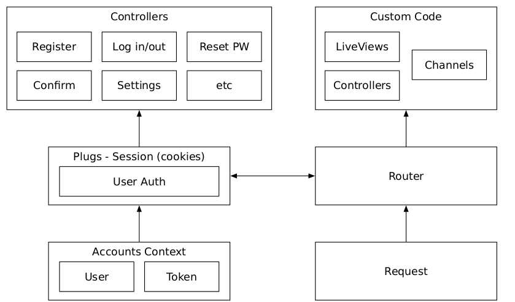
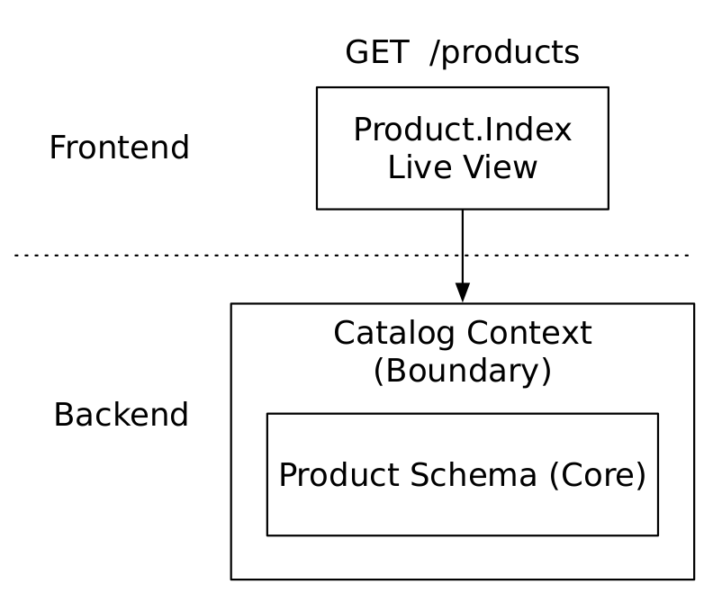
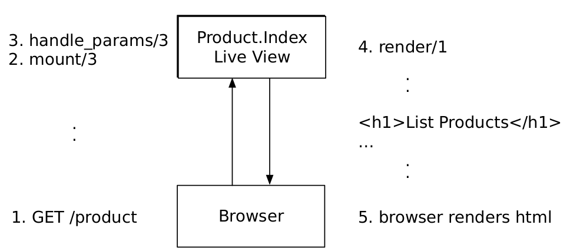
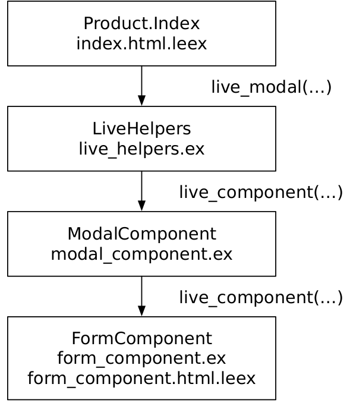

# Phoenix LiveView

A summary for Phoenix and Phoenix LiveView.

## Phoenix

### Flow CRC pattern

Phoenix follows the pattern **CRC** (Constructors Reducers and Converters). This is a representation of this pattern:

```elixir
connection_from_request
|> endpoint
|> router
|> custom_application
```
* The **endpoint** has a couple of configurations and Plug where the router is the last one.
* The **router** connect a request to the module that will process it and set policies (how a request should be managed), e.x.: accept only `JSON` for `:api` requests.
* The **custom_application** can be a Phoenix controller, a Phoenix channels application, or a live view.



### Plug.Conn

Plugs == reducers, they take a Plug.Conn as he first param and returns a Plug.Conn.

#### Migration (core part)

The migration file defines a database table, products , along with a set of fields for that table.
**IMPORTANT** Always take a look at generated file because some times it doesn't do what we need.

#### Schema (core part)

Think of schemas as maps between two kinds of data.
On the database side is the `products` table we generated with our migration.
On the Elixir side, the `Product` schema knows how to translate between
the `products` database table and the `Pento.Catalog.Product` Elixir struct.

### Context

A Phoenix Context is a module in your Phoenix application that provides an API for a service or resource.
It is responsible for managing uncertainty, external interfaces, and process machinery.

**Developer tip**: use **with** instead of **pipes** because is easier to control errors with **with**.

* Sample:
```elixir
# pipes
def send_sale_skus(query) do
query
|> Product.cheap_product_skus(25.00)
|> run_query # if run_query fails what happen with send? this pipe fails
|> Service.send_bargains
end
# with
def send_sale_skus(query) do
	with {:ok, products} <- get_sale_skus(query),
		 {:ok, response} <- Service.send_bargains(products) do
	    response
	else
	{:error, reason} ->
		IO.puts "Error sending sale skus: #{reason}"
	end
end
```

**Generate a context wihout liveview**

```shell
mix phx.gen.context Catalog Product products name:string description:string unit_price:float sku:integer:unique
```

* Catalog: schema (core).
* Product (Context).
* 

## LiveView

### LiveView Flow

Router => liveview.mount/3 => liveview.render/2

The sample code could be generated with [Generate a LiveView](#generate-a-liveview)
command on this guide.





### Generate a LiveView

We’ll construct the generator command such that it will generate a Catalog context with a schema for Product, corresponding to a products database table. A product will have name , description , unit_price , and SKU fields, like this:

```bash
mix phx.gen.live Catalog Product products name:string description:string unit_price:float sku:integer:unique
```

### Forms



## Components

Components run in the same OTP server as their parent. There’s one shared state,
and one supervisor. That means error and failure handling all happen at the level of
the parent live view.

> Written with [StackEdit](https://stackedit.io/).
<!--stackedit_data:
eyJoaXN0b3J5IjpbMjE2NTcwMTAzLDE5NTA0NDMxNjAsNzgwND
M3NTM0LC05ODg1ODE0ODQsLTE4ODE4NzcwMTgsLTE0NDUyNTAx
NzYsLTM4ODU1ODYyNiwxNTE4ODQzMTgsLTE2NjE2MjgxNTcsLT
Q3ODAxOTU4Ml19
-->